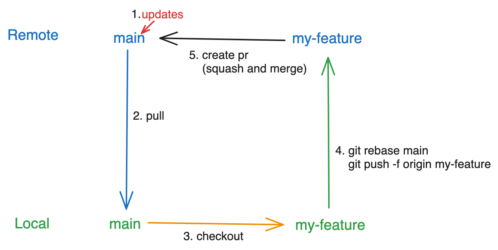

##### Manage code between `main` branch and a feature branch like `my-feature`.

#### 1.Create a New Branch

```bash
git checkout -b my-feature
```

#### 2.Make Changes in `my-feature` and Update to Remote `my-feature`

```bash
git add .
git commit -m 'some changes'
git push origin my-feature
```

#### 3.If there are some updates on `main` branch

- ##### Fetch the Latest Changes

```bash
git checkout main
git pulll origin main
```

- #### Rebase `my-feature` onto `main`

```bash
git checkout my-feature
git rebase main
git push -f origin my-feature
```



#### 4.Create a Pull Request on Github

#### 5.Review and Merge the Pull Request

#### 6.Update Local `main` Branch

```bash
git checkout main
git pull origin main
```

#### 7.Delete Local and Remote `my-feature`

```bash
git branch -d my-feature
```
